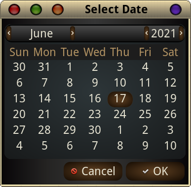

# eos-shifttime

eos-shifttime can revert all pacman packages to the state 
they were in on a specific date. Note: AUR packages are unaffected.

## Synopsis
```
Usage: eos-shifttime
```

You will be asked to enter the date you wish to revert to, and after confirming your intention and entering your password, all pacman packages will be set to that date. 



## Use cases

Usually this is used as a downgrade after an update has caused problems, but you do not need to track dependencies or interactions - you are simply returned to the state before the upgrade happened.

This can also be used to step forward in smaller steps rather than a mass update event. If you have not used or updated in some time (months? see the date of the last entry in 
`/var/log/pacman.log` or with the `pahis` app) then you can specify a date more recent than that to update to. You can be pretty sure than 1 week's worth of updates is 'safe' enough, but any increment can be used - if you have a problem you can go back and retry a smaller jump.

Another use case I have is for running a server on Encrypt-OS (I host a couple of repos). The procedure I use is to update to a date 1 week prior to the present. This gives a week between experiencing that particular set of updates on my desktop, and having them go through on the server - time enough to deal with any troubles with those updates. If the troubles haven't been dealt with - do not run the update until they are. 
